# 内存分配器 ptmalloc2、tcmalloc、jemalloc
## glibc
GNU C library's (glibc's) malloc library，由 ptmalloc (pthreads malloc)发展而来，ptmalloc源于dlmalloc。以下简称glibc
glibc是堆风格的内存分配器，啥叫堆风格呢？就是一堆大小不一的块放在一个叫“堆”的更大的内存空间中，主要是为了与使用bitmap和arrays来表示内存区域，或者所有的块大小相同的方式区分开。

glibc分配器中主要有以下几个概念：
 1. Arena
    这是一个被一个或多个线程共享的结构体，包含了一个或者多个heap，这些heap中包含了一系列用链表相连的空闲的chunk。Arena负责给相关联的线程分配空闲列表重的块。
 2. Heap
    堆是一块内存区域，会被划分成块(chunk)用来分配，每个堆只属于一个Anena。
 3. Chunk
    分配给应用程序的内存单元结构体chunk也被称为块。空闲的chunk由glibc管理并负责合并。chunk是对内存空间的包装结构体，除了直接给程序使用的地址空间以外还会包含一些其他信息，用于glibc对其进行管理。
 4. Memory
    应用程序的地址空间由RAM与swap分区组成

glibc内存管理方式是面向chunk的，因为它是glibc内部对内存空间抽象的最小单位。

每个chunk包含一些元数据(meta-data)在chunk header中，表示一个chunk的大小(size)，以及相邻chunk的位置(正如前面说的，chunk是用链表连接起来的)。当chunk被分配给应用程序之后，它只需要保存size就可以，其他的空间提供给应用程序使用。当chunk被释放之后，glibc会重新添加元数据用以管理，当应用程序向glibc申请内存是，glibc可以根据chunk的元数据快速找到可以用来分配的chunk。

chunk指针mchunkptr并不直接指向chunk的起始地址，而是指向前一个chunk的最后一个字也就是prev_size。除非前一个块是空闲的否则这个指针指向的位置是不可用的。

chunk的大小为8字节的整数倍，chunk size字段用最低三位用来表示chunk的falg，主要包含三个标记。
  
A(0x04)

     0.表示chunk属于main arena(主分配区，共享的，后面会讲)；1.表示chunk属于mmap，并且可以根据chunk的地址计算出其所属的heap的地址。
    

    
M(0x02)

    表示当前chunk是通过mmap系统调用得到的MMap chunk，此类chunk并不属于任何heap。

P(0x01)

     标记previous chunk是否被使用，此位置为1表示前面的chunk正在被应用使用，prev_size字段有效。但是在某些情况下，一些被应用程序释放的chunk此位依旧为1，比如在fastbins(下面)中的块，这表示previous chunk不会成为内存合并(合并相邻的空间)的对象。表示previous chunk是被应用程序使用或者被glibc优化层代码所使用。

chunk最小为8字节，当chunk足够大时会插入一些其他的信息(因为大的chunk不归heap管理，所以需要自成链表)。这些其他信息何时插入就是根据flag来决定的。
    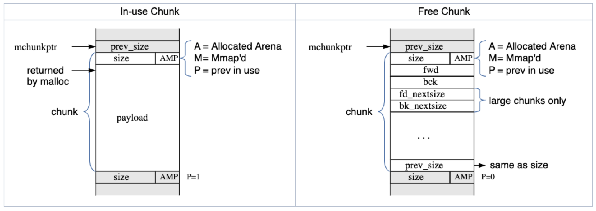

    注意：由于chunks在内存中是相邻的，所以当知道heap中第一个chunk的地址时(堆中最低地址)，可以利用size字段的信息(直接增加相应的偏移量)来遍历所有的chunk，但是没办法判断何时结束(因为是环形链表)。

### Arena
arean的数量是由操作系统核数决定的。

    32位系统：
    arena的数量 = 2 * 核的数量
    64位系统：
    arena的数量 = 8 * 核的数量

在一个单核32位系统上，运行多线程(主线程+3用户线程)应用时，线程数超过2*cpu，因此glibc确保area可以被多个线程共享。每个area包含一个互斥锁，当应用线程请求area，glibc中area数量没超过限制时将创建新的area返回给应用线程，当超过上限时，将尝试从已有的area中获取一个，加锁成功则返回给应用线程，失败则阻塞。

    注意：并不是area中所有的操作都要加锁的，fastbins是可以通过原子操作完成的，所以不需要加锁。

例如

- 主线程第一次调用malloc会创建main arena(起始位置位.bss，扩充时使用brk)。
- thread1和thread2第一次调用malloc，会分别创建thread area(使用mmap)。
- thread3第一次调用malloc时，不会创建新的area，而是reuse已存在的三个area之一。
- 遍历area，尝试获取锁，成功则将返回当前area；没有空闲的area则进入阻塞队列等待。

每个area包含一个或多个heap的内存，除了main area以外，其他的area在空间用光的时候都会使用mmap像操作系统申请空间。每个area包含一个特殊的top chunk指针，指向最大的可用chunk，也是最近分配的堆。

每个area管理的内存空间，可以很方便的通过当前area的初始堆来获取。
    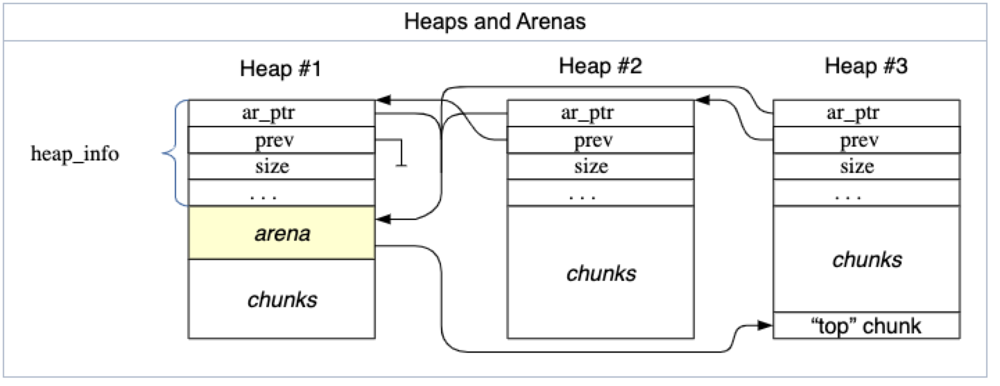
每个area中的chunk要么是正在被应用程序使用，要么是空闲的。已分配的chunk不会被追踪，空闲chunk在area中被保存到多个list中(bins)，用以快速寻找最合适的chunk。


glibc malloc中有三种数据结构：

- malloc_state(Arena header)：一个 thread arena 可以维护多个堆，这些堆共享同一个arena header。Arena header 描述的信息包括：bins、top chunk、last remainder chunk 等,每个area初始化只有一个heap(init heap)；
- heap_info(Heap Header)：每个堆都有自己的堆 Header（注：也即头部元数据）。当这个堆的空间耗尽时，新的堆（而非连续内存区域）就会被 mmap 当前堆的 aerna 里；
- malloc_chunk(Chunk header)：根据用户请求，每个堆被分为若干 chunk。每个 chunk 都有自己的 chunk header。内存管理使用malloc_chunk，把heap当作link list从一个内存块游走到下一个块。

main area只有一个heap，因此没有heap_info，空间耗尽时使用sbrk获取连续的空间，直到撞到内存映射段。


```c
struct malloc_state {
	mutex_t mutex;
	int flags;
	mfastbinptr fastbinsY[NFASTBINS];
	/* Base of the topmost chunk -- not otherwise kept in a bin */
	mchunkptr top;
	/* The remainder from the most recent split of a small request */
	mchunkptr last_remainder;
	/* Normal bins packed as described above */
	mchunkptr bins[NBINS * 2 - 2];
	unsigned int binmap[BINMAPSIZE];
	struct malloc_state *next;
	/* Memory allocated from the system in this arena. */
	INTERNAL_SIZE_T system_mem;
	INTERNAL_SIZE_T max_system_mem;
};

typedef struct _heap_info {
	mstate ar_ptr; /* Arena for this heap. */
	struct _heap_info *prev; /* Previous heap. */
	size_t size; /* Current size in bytes. */
	size_t mprotect_size; /* Size in bytes that has been mprotected
	PROT_READ|PROT_WRITE. */
	/* Make sure the following data is properly aligned, particularly
	that sizeof (heap_info) + 2 * SIZE_SZ is a multiple of
	MALLOC_ALIGNMENT. */
	char pad[-6 * SIZE_SZ & MALLOC_ALIGN_MASK];
} heap_info;

struct malloc_chunk {
	INTERNAL_SIZE_T prev_size; /* Size of previous chunk (if free). */
	INTERNAL_SIZE_T size; /* Size in bytes, including overhead. */
	struct malloc_chunk* fd; /* double links -- used only if free. */
	struct malloc_chunk* bk;
	/* Only used for large blocks: pointer to next larger size. */
	struct malloc_chunk* fd_nextsize; /* double links -- used only if free. */
	struct malloc_chunk* bk_nextsize;
};
```

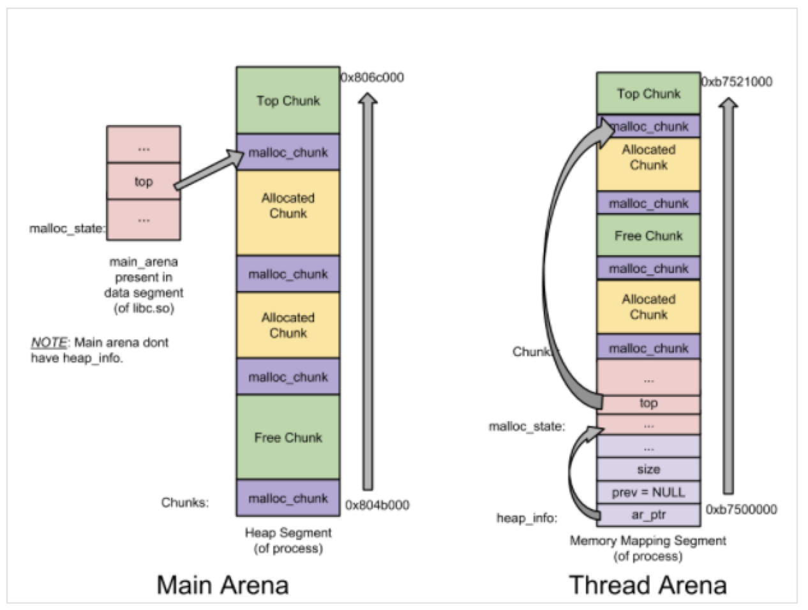

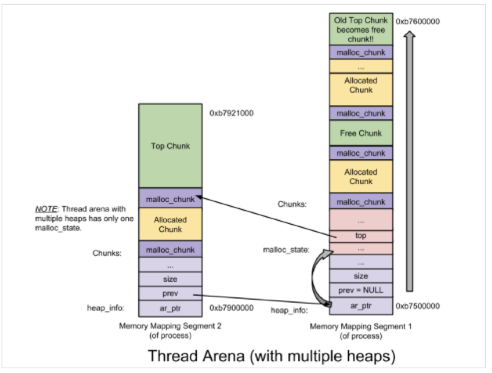

### Bins

上面代码段中可以看到，在malloc_state中有一个fastbinsY以及一个bins数组。其中fast用来保存fast bin，bins数组用来保存unsorted，small和large bin，一共126个bin。bins数组中1为unsorted，bin 2-63为small，bin 64 -126 为large。

#### Fast Bin
16-80bytes大小的chunk被称为fast chunk保存在此，这个单向链表中相邻的chunk不会被合并(更快，但有碎片)，这里的chunk分配与回收速度更快。当需要时会把里面的chunk移动到其他bins中。由于每次取chunk都从头取，所以不会读到链表中间的chunk。

bin的数量-10，增加删除都在链表表头(LIFO)。

chunk size-以8字节区分。例如，第一个fast bin（index 0）包含16字节chunk的binlist，第二个fast bin（index 1）包含24字节chunk的binlist …同一个fast bin的chunk一样大小。
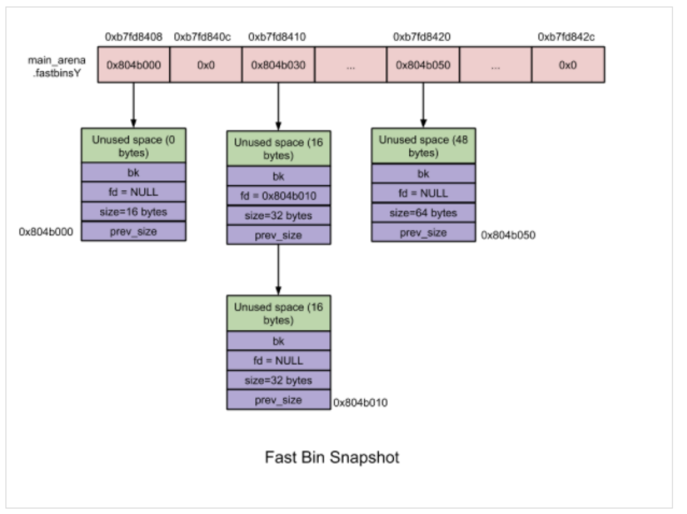
malloc初始化是fastbin最大字节为64，因此16-64字节的chunk为fast chunk

#### Unsorted Bin
当small或者large chunk被释放后不会立刻加入相应的bin，而是放到unsorted，为了能够使用最近free的chunk减少chunk的遍历，提高效率。使用一个双向循环链表表示，只有一个bin，其中的chunk大小没有限制。
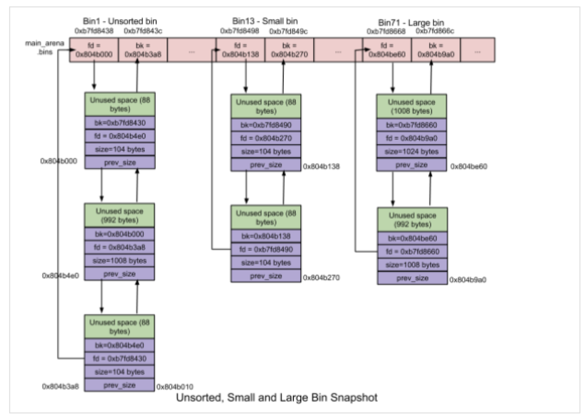

#### Small Bin
小于512字节的chunk放在这里，速度介于fast与large之间。一共有62个bin其中free chunk使用循环双向链表，增加在表头，删除在末尾(FIFO)。以8字节区分类似于fastbin，但是相邻的chunk会被合并，因此碎片减少，但是free速度减慢了。

#### Large Bin

大小大于等于512字节的chunk，一共有63个bin同样为循环双向链表，会被合并，分配时会查找最合适的chunk，因此增删可以发生在任何位置。

#### Top chunk
area顶部的chunk成为top chunk，不属于任何bin。在所有bin都没有空闲区域时使用，分割为分配给用户的chunk，剩下的remainder chunk成为新的top。当top chunk大小不够时会通过sbrk(main arena)或者mmap(thread arena)扩张。

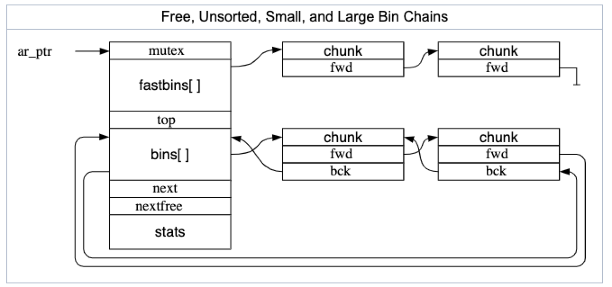

lagrebin中的nextsize指针可以很方便的寻找更大的bin，当找到满足条件的bin时，将取出其中第二个chunk，为了避免修改nextsize指针，插入同理。


### Thread Local Cache
每个thread会一直使用一个arena，如果在被别人使用，则阻塞。
为了减少竞争，每个thread会缓存一部分bin，每个bin只有一个chunk，所以可以按照chunk的大小遍历，如果请求失败，则走常规路径。


### 分配过程
1.如果tcache中有合适的直接返回。
2.如果请求的区域很大，直接调用mmap向操作系统申请空间，这个大小的阈值时动态的，除非写死，同时存在的这种mapping映射的内存数量是有限制的。
3.如果fastbin里有合适的，就拿过来，并且如果有同样大小的可用chunk就填充到tcache中。
4.fast没有找small，操作同上。
5.如果请求的区域比较大，那么把fast进行合并放到unsorted中，并将unsorted中的放到small/large中，这个过程伴随合并，如果遇到了合适的大小，则使用。
6.如果请求比较大，搜索large找到刚好满足大小的返回。
7.如果fast中还有chunk(在请求小空间时发生)，则进行合并，并重复前两步操作。
8.在拆分top chunk前可能会先扩大top。

在很多over-aligned分配器中，将会定位一个过大的块，并分成已经对齐的两部分，一部分返回，另一部分放入unsorted。

### 释放过程
释放内存，并不会直接还给操作系统，在操作系统看来这块内存还属于应用程序(被分配器接管已备后续使用)，只有当top chunk 中与未映射区域足够大时(空闲内存过多)才会还给操作系统。
1.如果tchache中有空闲，把chunk放到这里并返回。
2.如果chunk很小，放到fast中。
3.如果chunk是直接使用mmap获得的，munmap释放(通过标志位判断)。
4.是否有相邻的空闲chunk，合并一下。
5.放到unsorted，除非使用的是top。
6.如果chunk很大，合并fastbin，看看top是否过大来决定要不要释放给操作系统，这一步可能会在malloc或者其他调用时执行，为了性能考虑。

### 重分配算法

如果是使用mmap调用的空间，如果需要调用mremap，是否是同一地址取决于操作系统内核。如果不支持munmap，那么返回的是同一地址，除非发生malloc-copy-free。

对于arena 中的chunk

1.如果chunk太大了值得重新分配，那么chunk切成两部分，一部分包含旧地址返回，另一部分还给arend。
2.如果要更大的空间，那么检查相邻的chunk是否被使用，进行合并，返回就地址(top可以直接扩展)。
3.如果要更大的空间，并且没办法合并了，那么只能调用malloc-copy-free了。

### arenas 切换
通常整个程序生命周期中，分配的arena被看作是不会变的，但实际上是会切换的。
1.当关联的arena没办法为当前程序分配内存时(即所有的方法都尝试失败)。
2.如果重新拿到的arena跟原来的不一样，贼返回ENOMEM。

### 问题
如果后分配的内存先释放，无法及时归还系统。因为 ptmalloc 收缩内存是从 top chunk 开始,如果与 top chunk 相邻的 chunk 不能释放, top chunk 以下的 chunk 都无法释放。
内存不能在线程间移动，多线程使用内存不均衡将导致内存浪费
每个chunk至少8字节的开销很大
不定期分配长生命周期的内存容易造成内存碎片，不利于回收。
加锁耗时，无论当前分区有无耗时，在内存分配和释放时，会首先加锁。

## tcmalloc
tcmalloc是Google开发的内存分配器，在Golang、Chrome中都有使用该分配器进行内存分配。有效的优化了ptmalloc中存在的问题。根据测试ptmalloc2耗时300ns的操作tcmalloc只需要50ns，而且内存利用率更高了。

go里面用的就是tcmalloc分配器，但是注释里说做了少量修改。但是随着go版本的迭代，分配器也在进一步的修改，但是主要的思想还是集成自tcmalloc。
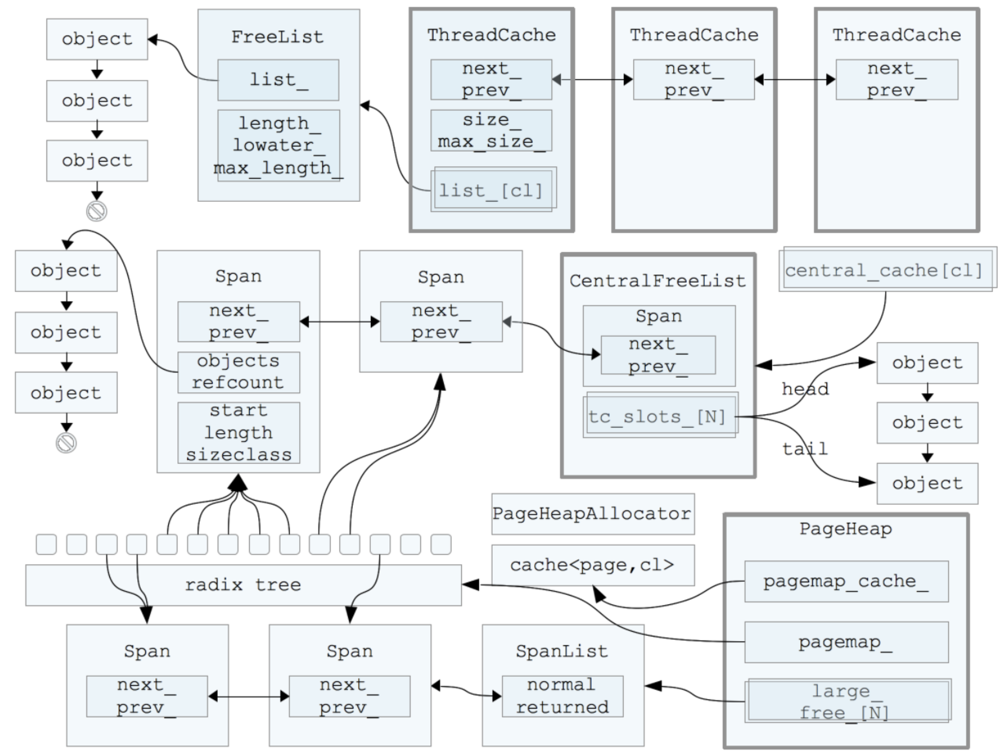

### 分配算法
按照内存大小tcmalloc将内存分配分为三类

- 小对象分配(0,256KB]
- 中对象分配(256KB,1MB]
- 大对象分配(1MB,...)

tcmalloc将整个虚拟内存空间划分为n个同等大小的Page默认大小为8KB，n个连续的page称为一个Span。定义PageHeap类来处理向OS申请内存的操作，并提供了一层缓存，PageHeap即为整个可供应用程序动态分配的内存的抽象。

PageHeap以Span为单位向OS申请内存，申请到的span可以有一个或者n个page。可以划分成一系列的小对象，供小对象内存分配使用，也可以当作一整块做中对象或者大对象分配。

#### 小对象分配

Size Class，对于256KB以内的小对象分配，tcmalloc划分了88个左右的类别(官方自己说的，但是有人测试为85个类别)，被称为Size Class，每个size class对应一个大小，比如8，16，32字节。申请内存时统一向上取整(虽然会产生碎片，但是可以对齐)，tcmalloc将这里的内部碎片控制在12.5%以内。

ThreadCache

每个线程中都有一份单独的缓存，在这段区域内分配以及回收内存是不需要加锁的，每个ThreadCache中每个size class都有一个单独的FreeList，缓存了n个还未被应用程序使用的空闲对象。所有线程的ThreadCache链接成为双向链表。
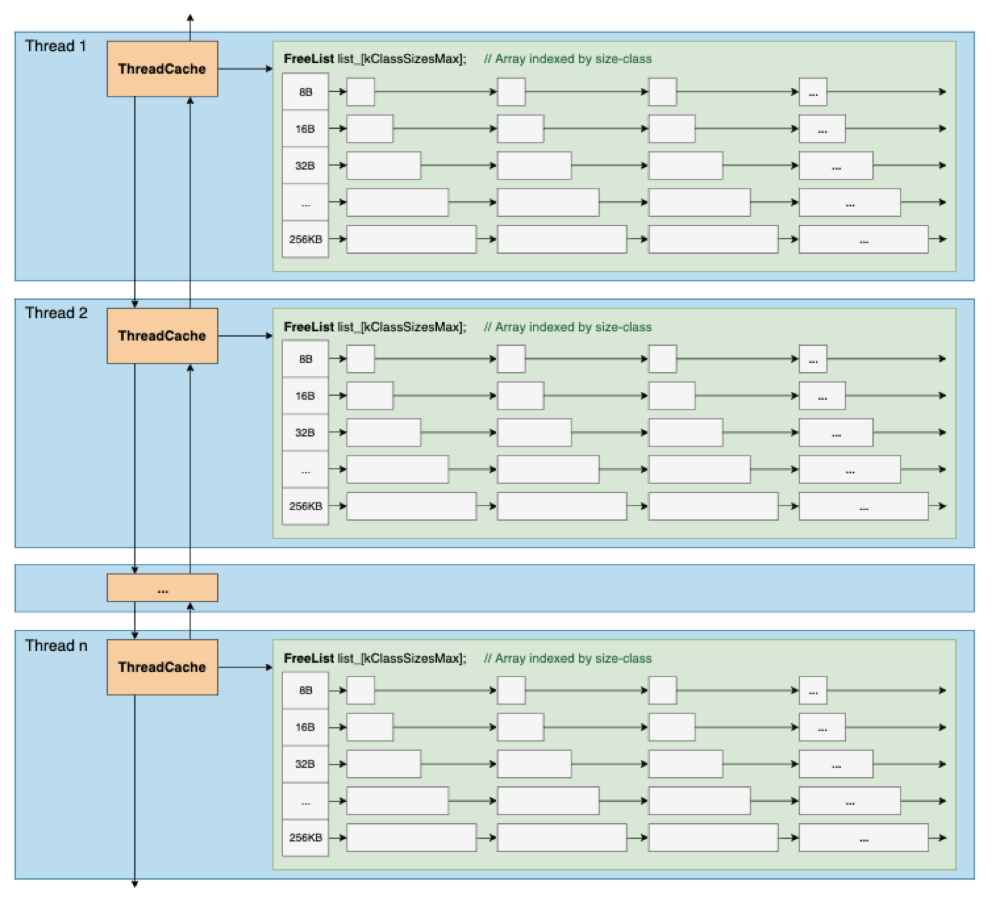

CentralCache

central cache为所有线程的公用缓存。结构跟thread Cache内部是一致的，空闲对象称为CentralFreeList，各个thread cache从中取对象，需要加锁。
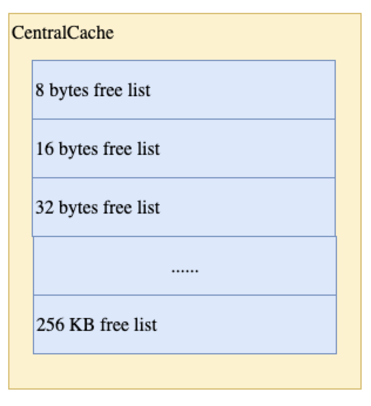

PageHeap

PageHeap可以认为是CentralCache与OS之间的缓存。当CentralCache空闲对象不够用时，将会向PageHeap申请内存，可能来自于PageHeap的缓存或者向OS申请。并将申请的内存拆分成一系列空闲对象添加的size class的CentralFreelist中。

PageHeap中根据内存块(span)大小采取了两种不同的缓存策略。128个Page以上的span，每个大小都用相应的链表缓存，超过128个page的span存储在一个有序set中。
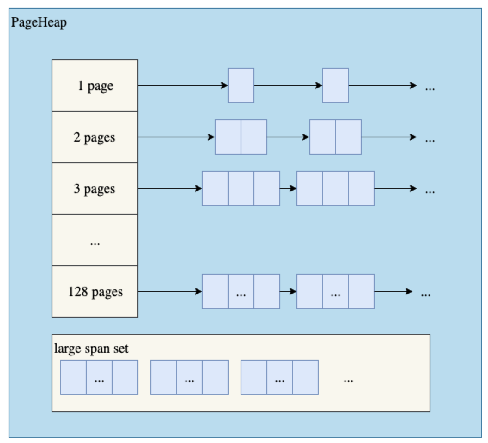

内存回收

释放内存时近插入thread cache中，当满足一定条件时，将放回到central cache。

#### 中对象分配
中对象分配时首先会将眼申请的pages取整，会产生1-8KB的内部碎片。之后向PageHeap申请一个指向指定数量page的span返回首地址。
根据上图PageHeap的结构，对于128个page以内的span假设为k直接从k个page的span链表开始遍历，一直到128个page的span，找到第一个非空的链表。从链表中取出span之后进行拆分，假设当前span一共有n个page，k个page作为结果返回，n-k个page组成新span插入的n-k个page的span链表中。如果找不到非空链表，则视为大对象。

#### 大对象分配

存储大对象span的set是一个按照大小排序的set，方便按照大小搜索，查找时，找到满足条件中最小的那个span，进行拆分，操作同中对象。如果没找到，则使用sbrk或者mmap向OS申请内存生成新的span。
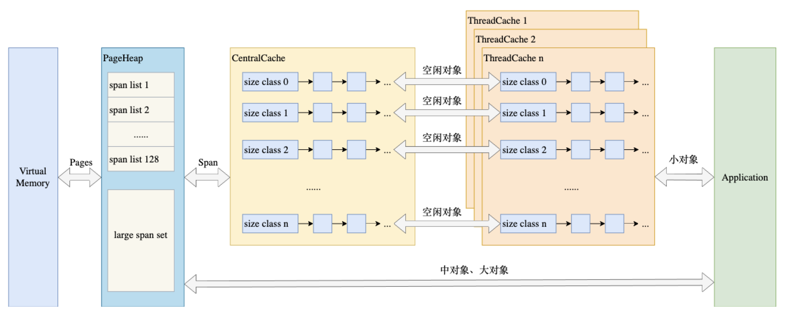
对于小对象，应用程序与内存之间实际上有三层缓存。

### tcmalloc具体实现

#### Page
page是tcmalloc内存管理的基本单位，默认8KB可以手动修改，page越大速度越快但是碎片更多，空间换时间。

整个虚拟地址空间看作page的集合，在8KB大小下，地址右移13位即得到page的地址，pageid。

#### Span
一个或者多个page组成一个span，tcmalloc以span为单位向系统申请空间。

span中记录pageid，也就是page的起始地址，length即包含了多少个page，以及prev，next指向其他的span，当分配给小对象时sizeclass记录当前对应的size class。

span分配给应用程序或者CentralHeap都会被看作使用中，normal队列时空闲的，returned队列也是空闲的，但是已经还给操作系统了，可以访问，但是数据已经没了。

被拆分成多个小对象的span中记录一个空闲对象链表object，由central cache维护。新创建的span，按照size class划分之后，每个object首首相连，小对象头部存储下一个的地址。
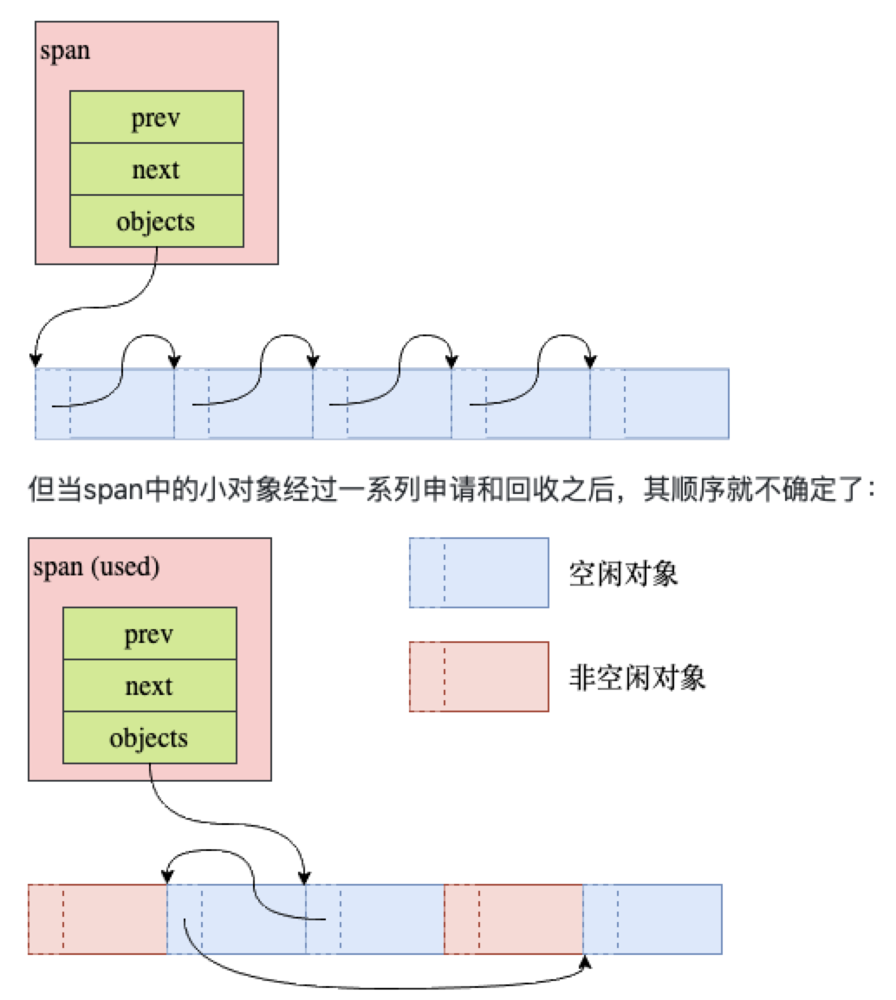

顺序被打乱没有影响，只有一个span中全部对象都被释放才会还给PageHeap。

在tcmalloc中维护着一个pagemap来确定每个page属于哪一个span。
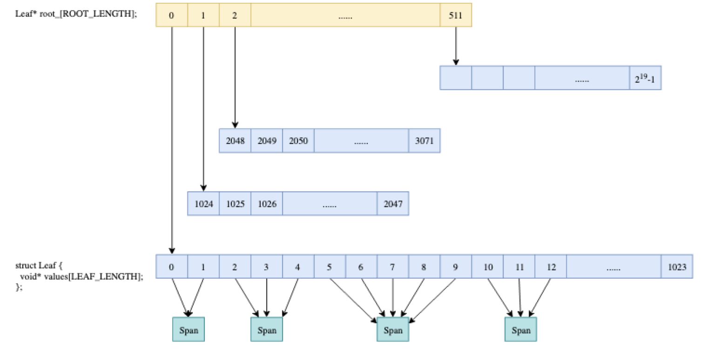

root中由512个指针，每个指针指向一个1024个指针的数组，每个数组的索引为pageid，值为span的指针，只有root分配内存，其他的用到时再分配，32为2级，64位3级。

### Size Class

不同大小的对象被分类成不同的size class，用来分配空间，比如896字节对应编号为30的size class，下一个size class 31大小为1024字节，那么897-1024字节之间的都会分配到1024字节的空间。

跨度划分

- 16字节以内，每8字节划分一个size class。满足这种情况的size class只有两个：8字节、16字节。
- 16~128字节，每16字节划分一个size class。满足这种情况的size class有7个：32, 48, 64, 80, 96, 112, 128字节。
- 128B~256KB，按照每次步进(size / 8)字节的长度划分，并且步长需要向下对齐到2的整数次幂，比如：
144字节：128 + 128 / 8 = 128 + 16 = 144
160字节：144 + 144 / 8 = 144 + 18 = 144 + 16 = 160
176字节：160 + 160 / 8 = 160 + 20 = 160 + 16 = 176
以此类推


一次性移动多个空闲对象

	ThreadCache从CentralCache中获取空闲对象，同时也会归还超出限制的空闲对象，每次移动64KB大小的内存，根据不同的size class 大小移动不同的数量，至少两个，最多32个。

一次申请多个page

	对于每个size class，tcmalloc向OS申请内存时，一次申请一个span然后切分。每个size class对应的page从1开始递增，直到span剩余空间小于1/8，因此碎片控制在12.5%以下。(注释说分配page需满足上文说一次移动多个对象的限制，64KB，2，32，但实际代码满足1/4即可)。

合并

相同数量page相同对象数量的相邻size class会被合并为一个sizeclass

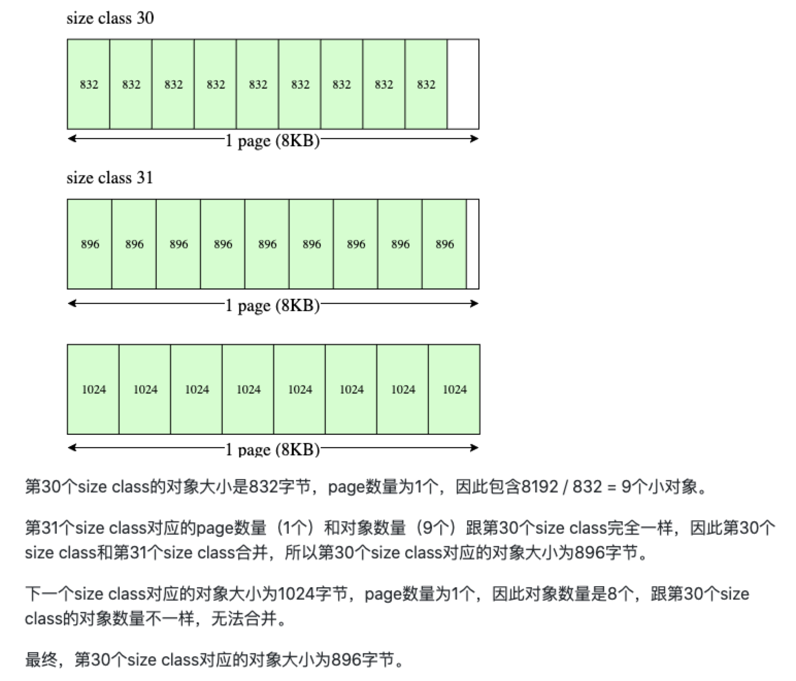

记录映射关系

每个size class 需要维护，一个对象的大小，一个申请page的数量，一批移动对象的数量。分别保存在class_to_size_，num_objects_to_move_， class_to_pages_三个数组中。
	
	小对象大小到size class编号的映射，保存在一个一维数组class_array_中。size class编号可以用一个字节表示，小对象大小对应的size class可以使用256KB的内粗。但是size class之间有间隙（1024字节以内间隔至少8字节，1024以上间隔至少128字节），所以使用数组索引进行压缩。

计算任意内存地址对应的对象大小

当释放内存时，需要获取钥匙放的内存大小(因为只拿到了首地址)。ptr>>13得pageID，从pagemap中查到span，span中记录了size class编号，根据class_to_size决定释放的内存大小。不需要在内存块头部记录内存大小，提高内存利用率。

小结
size class的实现中有很多省空间省时间的做法：

- 省空间
- 控制划分跨度的最大值（8KB），减少内部碎片
- 控制一次申请page的数量，减少内部碎片
- 通过计算和一系列元数据记录内存地址到内存大小的映射关系，避免在实际分配的 内存块中记录内存大小，减少内存浪费
- 两级PageMap或三级PageMap
- 压缩class_array_
- 省时间
- 一次申请多个page
- 一次移动多个空闲对象

### PageHeap

空间不足时，并且向OS申请的内存达到128MB，且空闲内存超过申请总内存的1/4则释放空闲内存，以便获取连续内存，并减少系统调用。

应用程序使用的内存每次至少1MB，自身元数据使用的内存每次至少8MB。由于内存对齐会产生外部碎片，返回新的sbrk指针与原地址中间有一段不能用。

span释放时直接放到对应的空闲链表中，地址空间上连续的空闲span会被合并。

### ThreadCache
使用TSD为每个线程分配一个threadcache在第一次申请内存时，线程结束时自动销毁。threadcache总大小默认为32MB每个线程的默认为4MB，调整总大小事，会修改每个分配的大小。

#### 慢启动算法
每个treadcache中的freelist长度很重要，太大容易浪费，太小需要频繁加锁。

慢启动中，freelist使用的越频繁，最大长度就越大，如果释放更多，则最大长度会到达某个阈值，以有效的将空间还给centralcache。

最大长度从1开始递增，当达到每次移动对象batch_size大小时，每次从centralcache取对象时，增加batch_size最大8192.释放同理，但是到了batch_size之后不会立刻调整，累计三次之后减去batch_size。

在释放程序内存的时候会触发垃圾回收，遍历所有threadcache中的freelist，将一些对象移动到central freelist中，每次移动l个，l记录自上次垃圾回收以来，freelist最小长度。


### CentralCache
central cache真正管理的是span，根据之前的图，empty链表保存没有空闲空间的span，noempty保存仍有空闲空间的span。
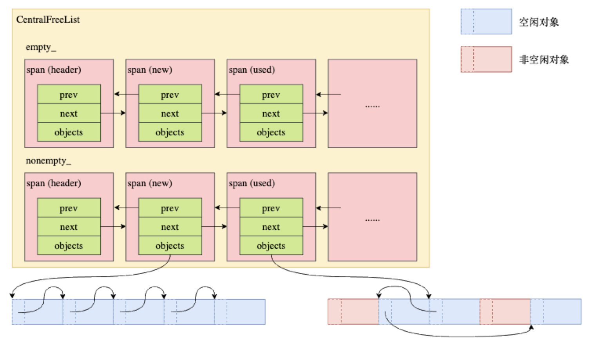

central freelist维护span的成员变了refcount记录thread cache从中获取了多少对象，全部归还之后变为0，centralcache将次span归还heap。

treadcache 从central中取小对象时，每次移动的数量由max_length与batch_size中最小的决定，并且每次只是修改对应链表的首尾指针。

### 总结
tcmalloc的优势
- 小内存可以在ThreadCache中不加锁分配(加锁的代价大约100ns)
- 大内存可以直接按照大小分配不需要再像ptmalloc一样进行查找
- 大内存加锁使用更高效的自旋锁
- 减少了内存碎片

然而，tcmalloc也带来了一些问题，使用自旋锁虽然减少了加锁效率，但是如果使用大内存较多的情况下，内存在Central Cache或者Page Heap加锁分配。而tcmalloc对大小内存的分配过于保守，在一些内存需求较大的服务（如推荐系统），小内存上限过低，当请求量上来，锁冲突严重，CPU使用率将指数暴增。

## jemalloc

jemalloc是facebook推出的，目前在firefox、facebook服务器、android 5.0 等服务中大量使用。 jemalloc最大的优势还是其强大的多核/多线程分配能力.可以说, 如果内存足够大, CPU的核心数量越多, 程序线程数越多, jemalloc的分配速度越快。

为了避免竞争最好的方法就是线程之间的内存没有任何关联，通过arena将空间进行划分，两个arena在地址空间上基本没任何关联，线程与arena绑定，因此可以无锁，但是如果多个线程共享一个arena，则需要加锁。

chunk是次于arena的次级内存结构，每个chunk头部包含自身信息，目前默认大小4MB。chunk内部以page为单位，前几个page用于存放chunk元数据(默认6个)后面跟着一个或多个page的runs。runs可以是未分配区域，多个小对象组合在一起组成run，元数据放在run头部。大对象构成的run，元数据放在chunk头部。使用chunk时，把它分割成多个run，记录到bin中，不同的size class有不同的bin。bin中用红黑树维护run，run里使用bitmap记录分配状况，每个arena里维护一组按地址排列可获得到run的红黑树。

```c
struct arena_s {
    ...
    /* 当前arena管理的dirty chunks */
    arena_chunk_tree_t  chunks_dirty;
    /* arena缓存的最近释放的chunk, 每个arena一个spare chunk */
    arena_chunk_t       *spare;
    /* 当前arena中正在使用的page数. */
    size_t          nactive;
    /*当前arana中未使用的dirty page数*/
    size_t          ndirty;
    /* 需要清理的page的大概数目 */
    size_t          npurgatory;
 
 
    /* 当前arena可获得的runs构成的红黑树， */
    /* 红黑树按大小/地址顺序进行排列。 分配run时采用first-best-fit策略*/
    arena_avail_tree_t  runs_avail;
    /* bins储存不同大小size的内存区域 */
    arena_bin_t     bins[NBINS];
};
/* Arena chunk header. */
struct arena_chunk_s {
    /* 管理当前chunk的Arena */
    arena_t         *arena;
    /* 链接到所属arena的dirty chunks树的节点*/
    rb_node(arena_chunk_t)  dirty_link;
    /* 脏页数 */
    size_t          ndirty;
    /* 空闲run数 Number of available runs. */
    size_t          nruns_avail;
    /* 相邻的run数，清理的时候可以合并的run */
    size_t          nruns_adjac;
    /* 用来跟踪chunk使用状况的关于page的map, 它的下标对应于run在chunk中的位置，通过加map_bias不跟踪chunk 头部的信息
     * 通过加map_bias不跟踪chunk 头部的信息
     */
    arena_chunk_map_t   map[1]; /* Dynamically sized. */
};
struct arena_run_s {
    /* 所属的bin */
    arena_bin_t *bin;
    /*下一块可分配区域的索引 */
    uint32_t    nextind;
    /* 当前run中空闲块数目. */
    unsigned    nfree;
};
```

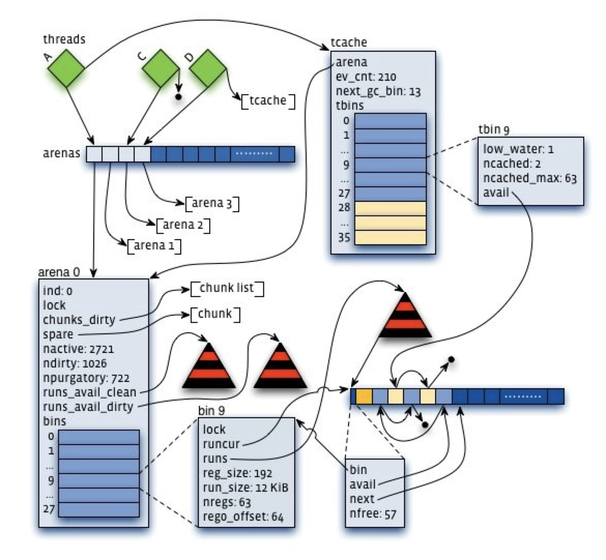

jemalloc同样划分大小，分了 small object (例如 1 – 57344B)、 large object (例如 57345 – 4MB )、 huge object (例如 4MB以上)。同样拥有tcache，当分配的内存大小小于tcache_maxclass时，jemalloc会首先在tcache的small object以及large object中查找分配，tcache不中则从arena中申请run，并将剩余的区域缓存到tcache。过大的，直接从arena申请，但是分配的内存不被arena管理类似于ptmalloc，由一颗单独的红黑树管理。

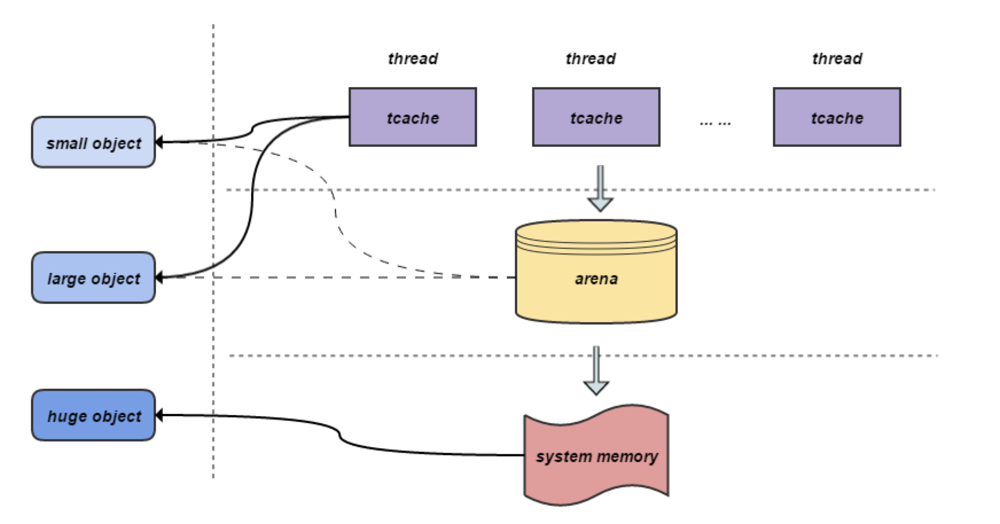

优势，锁更少了，确实相对于tcmalloc，最上层的缓存也进行了锁细化。

## 总结
总的来看，作为基础库的ptmalloc是最为稳定的内存管理器，无论在什么环境下都能适应，但是分配效率相对较低。而tcmalloc针对多核情况有所优化，性能有所提高，但是内存占用稍高，大内存分配容易出现CPU飙升。jemalloc的内存占用更高，但是在多核多线程下的表现也最为优异。

内存管理库的短板和优势其实也给我们带来了一些思考点，在什么情况下我们应该考虑好内存分配如何管理：

多核多线程的情况下，内存管理需要考虑内存分配加锁、异步内存释放、多线程之间的内存共享、线程的生命周期
内存当作磁盘使用的情况下，需要考虑内存分配和释放的效率，是使用内存管理库还是应该自己进行大对象大内存的管理。（在搜索以及推荐系统中尤为突出）